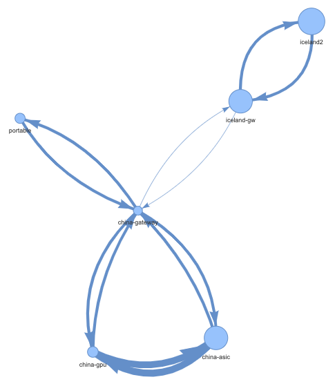
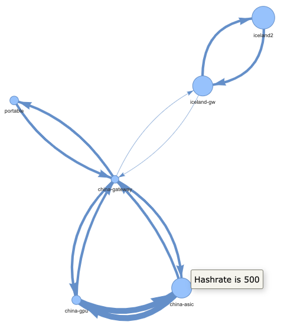
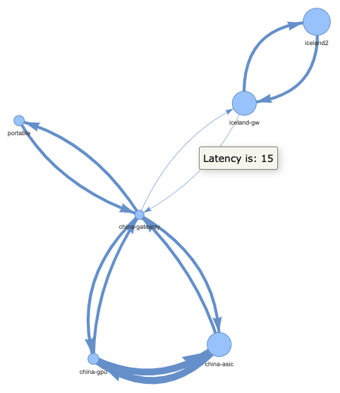

# minesim-nv
Network visualizer for [https://github.com/LarryRuane/minesim](https://github.com/LarryRuane/minesim)

## Installation

developed and tested with [https://github.com/sasa-buklijas/minesim-nv/blob/main/.python-version](https://github.com/sasa-buklijas/minesim-nv/blob/main/.python-version) python version

```
git clone https://github.com/sasa-buklijas/minesim-nv.git
cd minesim-nv
# dependencies 
	# we recommend using virtualenv
pip install requirements-manual.txt

```

## Usage
`python minesim-nv.py test_data/network.txt`

`test_data/network.txt` is network configuration file for [https://github.com/LarryRuane/minesim](https://github.com/LarryRuane/minesim)

## Ouput

- larger hashrate, larger node size
	- smaller hashrate, smaller node size
- larger latency, smaller edge
	- smaller latency, larger edge



### hashrate of node is available as tooltip



### latency of edge/connection is available as tooltip

